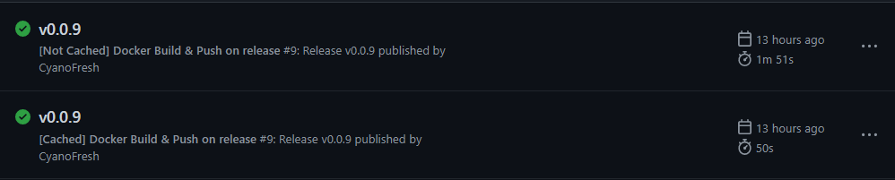

Docker Compose + GitHub Actions + Layers Cache
===

Decrease build time of docker compose inside GitHub Actions using layers cache.

2x faster builds:



## Description

* `.github/workflows/not-cached.yml` uses `./docker-compose.ci.not-cached.yml`
* `.github/workflows/cached.yml` uses `./docker-compose.yml`. Caching achieved by:
  * ENV variables `DOCKER_BUILDKIT` and `COMPOSE_DOCKER_CLI_BUILD`
  * docker/setup-buildx-action
  * --build-arg BUILDKIT_INLINE_CACHE=1
  * `cache_from` inside docker-compose file:
    ```yml
    build:
      context: ./app1
      cache_from:
      - ghcr.io/cyanofresh/docker-compose-ga-cache-example_app1
    ```
